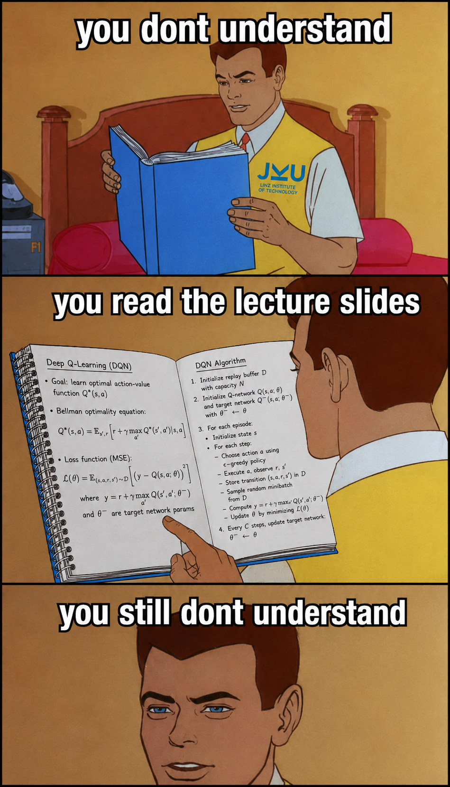

# AI Master — Lecture Summaries

Structured LaTeX summaries and curated exam-question collections for the AI Master programme.
Built from lecture slides, notes, and personal study sessions.

<p align="center">
  
</p>

**How to actually use this:** pick a course from the [table below](#courses) and open its
`summary.pdf` straight here on GitHub — no LaTeX needed. Read the prose, let the colored
boxes flag the definitions, key theorems, and exam traps, then grind the matching
`exams.pdf` question set before the real thing. And then…

<p align="center">
  
</p>

---

## What is this?

Each course folder contains:

| File | What it is | When |
|------|------------|------|
| `summary.pdf` / `summary.tex` | Comprehensive lecture summary | always |
| `exams.pdf` / `exams.tex` | Curated old exam questions with an answer key | when past exams are available |
| `exams_solutions.pdf` / `exams_solutions.tex` | The same questions with worked solutions inline | optional |

(Deep Reinforcement Learning additionally ships a dense 2-sided `cheatsheet`.)

The summaries are written in a consistent visual style: one accent color, typed prose as default, and colored boxes used only as landmarks (definitions, theorems, examples, intuition, exam traps).

---

## Courses

| Course | Summary | Exams | Status |
|--------|---------|-------|--------|
| [AI in Life Sciences](courses/ai-in-life-sciences/) | [PDF](courses/ai-in-life-sciences/summary.pdf) | [PDF](courses/ai-in-life-sciences/exams.pdf) | reviewed |
| [Computer Vision](courses/computer-vision/) | [PDF](courses/computer-vision/summary.pdf) | [PDF](courses/computer-vision/exams.pdf) | reviewed |
| [Deep Reinforcement Learning](courses/deep-reinforcement-learning/) | [PDF](courses/deep-reinforcement-learning/summary.pdf) | [PDF](courses/deep-reinforcement-learning/exams.pdf) | reviewed |
| [DL Architectures & Generative Techniques](courses/dl-architectures-generative-techniques/) | [PDF](courses/dl-architectures-generative-techniques/summary.pdf) | [PDF](courses/dl-architectures-generative-techniques/exams.pdf) | reviewed |
| [Genome Analysis & Transcriptomics](courses/genome-analysis-transcriptomics/) | [PDF](courses/genome-analysis-transcriptomics/summary.pdf) | — | draft |
| [ML Supervised Techniques](courses/ml-supervised-techniques/) | [PDF](courses/ml-supervised-techniques/summary.pdf) | [PDF](courses/ml-supervised-techniques/exams.pdf) | draft |
| [ML Unsupervised Techniques](courses/ml-unsupervised-techniques/) | [PDF](courses/ml-unsupervised-techniques/summary.pdf) | [PDF](courses/ml-unsupervised-techniques/exams.pdf) | reviewed |
| [Reinforcement Learning](courses/reinforcement-learning/) | [PDF](courses/reinforcement-learning/summary.pdf) | [PDF](courses/reinforcement-learning/exams.pdf) | reviewed |
| [Robopsychology](courses/robopsychology/) | [PDF](courses/robopsychology/summary.pdf) | — | reviewed |
| [Structural Bioinformatics](courses/structural-bioinformatics/) | [PDF](courses/structural-bioinformatics/summary.pdf) | — | draft |

**Status legend:** `draft` = work in progress, `usable` = reasonably complete, `reviewed` = cross-checked against the course.

---

## Use this repo

**Just read:** Click any PDF link in the course table above, or browse to a course folder and open the PDF directly on GitHub.

**Clone locally:**
```bash
git clone https://github.com/steveTgit/AI_Master.git
cd AI_Master
open courses/reinforcement-learning/summary.pdf
```

Lecture slide PDFs are not tracked (they change every semester). Only the compiled summaries and exam collections are committed.

---

## Contribute a small fix

Found a typo, wrong formula, or missing answer? You can fix it entirely in the GitHub web UI — no git knowledge required.

1. Navigate to the file (e.g. `courses/reinforcement-learning/summary.tex`).
2. Click the pencil icon (Edit this file).
3. Make your change.
4. Click **Propose changes** → **Create pull request**.

See [CONTRIBUTING.md](CONTRIBUTING.md) for the full guide.

---

## Contribute more substantially

Adding a section, converting an old-format file, or contributing a new course? See [CONTRIBUTING.md](CONTRIBUTING.md) for:

- How to fork and clone the repo.
- The expected folder structure for each course.
- How to compile `.tex` files with `latexmk`.
- Style rules and LaTeX conventions (also in `docs/style-guide.md`).

---

## Repo structure

```
AI_Master/
├── README.md
├── CONTRIBUTING.md
├── CLAUDE.md                  ← AI-editing guidance (for Claude Code)
├── LICENSE
├── templates/
│   ├── summary_template.tex   ← copy this to start a new summary
│   └── exams_template.tex     ← copy this to start a new exam collection
├── docs/
│   ├── style-guide.md         ← LaTeX style rules for human contributors
│   └── maintainer-notes.md    ← notes for repo maintainers
├── .github/
│   ├── pull_request_template.md
│   ├── ISSUE_TEMPLATE/
│   └── workflows/
└── courses/
    └── <course-slug>/
        ├── README.md
        ├── summary.tex / summary.pdf
        ├── exams.tex / exams.pdf              (when past exams exist)
        ├── exams_solutions.tex / .pdf         (optional, worked solutions)
        └── figures/
```

Course folders use lowercase kebab-case slugs. Lecture slides live in `slides/` inside each course folder and are not tracked by git.

---

## About `CLAUDE.md`

[CLAUDE.md](CLAUDE.md) contains instructions for Claude Code (the AI assistant used to write and edit the `.tex` files). It is not human onboarding — see [docs/style-guide.md](docs/style-guide.md) for the human-readable equivalent.

---

## Author

Stefan Eder
